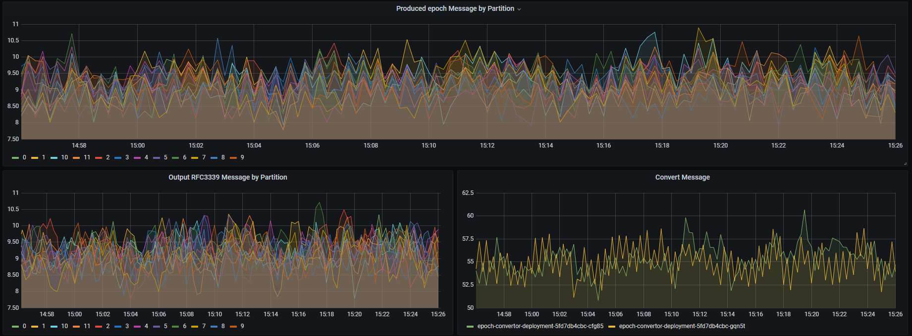

# K8s Cluster
This Vagrantfile and Ansibles help you to bring up a K8s cluster with kubeadm and contains below services and parts.
- Monitoring with Prometheus
- Kafka Cluster with Strimzi
- Epoch producer and converter
- CNI with calico

### Pre Requirements
* [Virtualbox](https://www.virtualbox.org/)
* [Vagrant](https://www.vagrantup.com/)


### Create Virtual Machines
Run `vagrant up` to bring up virtual machines.
```
$ vagrant up
```

The hostnames and IP addresses of the machines are per the below table:

| Name                                 |  IP | Role
|:-------------------------------------|:---:|:-----:|
| `kubemaster` | 192.168.99.20 | master
| `worker1` | 192.168.99.21 | worker
| `worker2` | 192.168.99.22 | worker

***Note:*** to add new worker just add them in 
[Vagrantfile](https://github.com/parsa97/simpleK8sKafka/blob/master/Vagrantfile)

***Note:*** Master node is untainted and the scheduler can schedule pods on the master node too

### Create Kubernetes cluster

When it's done, you are able to ssh in the kubemaster node and run kubectl commands.
```
$ vagrant ssh kubemaster
```

```
vagrant@kubemaster:~$ kubectl get nodes
NAME         STATUS   ROLES                  AGE   VERSION
kubemaster   Ready    control-plane,master   8h    v1.20.2
worker1      Ready    <none>                 8h    v1.20.2
worker2      Ready    <none>                 8h    v1.20.2
```

# Monitoring

There is a fork of 
[Kube-prometheus](https://github.com/parsa97/kube-prometheus)
for monitoring and some changes are made to add extra dashboards and datasource.

***Dashboards***
All default K8s dashboards are deployed and Extra dashboards are listed below:

- Strmizi Kafka
- Strimzi Kafka Exporter
- Strimzi Operators
- Strmizi Zookeeper
- Epoch Producer and Convertor



***Monitoring Pods:***

```
vagrant@kubemaster:~$ kubectl get pods -n monitoring -o wide
NAME                                   READY   STATUS    RESTARTS   AGE     IP               NODE       
alertmanager-main-0                    2/2     Running   4          4h14m   192.168.141.54   kubemaster 
alertmanager-main-1                    2/2     Running   4          4h14m   192.168.141.40   kubemaster 
alertmanager-main-2                    2/2     Running   4          4h14m   192.168.141.53   kubemaster 
blackbox-exporter-556d889b47-2z67v     3/3     Running   6          4h20m   192.168.141.46   kubemaster 
grafana-6fb87b494b-zk4wm               1/1     Running   2          4h19m   192.168.141.47   kubemaster 
kube-state-metrics-544cf87cfd-nsfvw    3/3     Running   6          4h19m   192.168.141.48   kubemaster 
node-exporter-l9r7r                    2/2     Running   4          4h19m   10.0.2.15        kubemaster 
node-exporter-ljnhw                    2/2     Running   2          4h7m    192.168.99.22    worker2    
node-exporter-qt7tg                    2/2     Running   2          4h13m   192.168.99.21    worker1    
prometheus-adapter-767f58977c-h25bh    1/1     Running   2          4h19m   192.168.141.49   kubemaster 
prometheus-k8s-0                       2/2     Running   5          4h14m   192.168.141.55   kubemaster 
prometheus-k8s-1                       2/2     Running   5          4h14m   192.168.141.51   kubemaster 
prometheus-operator-764cb46c94-ckw7g   2/2     Running   4          4h20m   192.168.141.45   kubemaster 
prometheus-prometheus-0                2/2     Running   5          4h14m   192.168.141.41   kubemaster 
```

***Grafana***

You just need to forward grafana port with kubectl port-forward to your localhost
```
$ kubectl --kubeconfig=/root/.kube/evalConfig port-forward -n monitoring svc/grafana 3000:3000
```

***Note:*** as you know the default username/passwords are admin:admin

# Kafka Cluster

[Strmizi](https://strimzi.io/) is used to deploy Kafka cluster which contains:
- Three Broker
- Two Zookeeper

There are pods affinity to prevent them to schedule on the same nodes.

***Pods***
```
vagrant@kubemaster:~$  kubectl get pods -n kafka -o wide
NAME                                          READY   STATUS    RESTARTS   AGE     IP                NODE       
epoch-converter-deployment-57568ff4fd-2fvrg   1/1     Running   5         4h14m   192.168.141.52    kubemaster  
epoch-converter-deployment-57568ff4fd-sckh4   1/1     Running   4         4h14m   192.168.141.50    kubemaster  
epoch-producer-deployment-5b7c94599-2dkk8     1/1     Running   4         4h14m   192.168.141.57    kubemaster  
kafka-epoch-entity-operator-cdd8f75cf-5cd2f   3/3     Running   3         4h14m   192.168.189.69    worker2     
kafka-epoch-kafka-0                           1/1     Running   0         4h13m   192.168.235.135   worker1     
kafka-epoch-kafka-1                           1/1     Running   1         4h12m   192.168.189.68    worker2     
kafka-epoch-kafka-2                           1/1     Running   2         4h12m   192.168.141.58    kubemaster  
kafka-epoch-kafka-exporter-55897df5c7-rbxhw   1/1     Running   4         4h14m    192.168.235.134   worker1    
kafka-epoch-zookeeper-0                       1/1     Running   2         4h14m    192.168.235.133   worker1    
kafka-epoch-zookeeper-1                       1/1     Running   2         4h14m    192.168.141.56    kubemaster 
strimzi-cluster-operator-68c6747bc6-f78nl     1/1     Running   2         4h19m    192.168.141.59    kubemaster 
```

***Topics***

Kafka auto-create topic is disabled and must create topics depends on the need.

There are two topics input and output.
| Name            |  Partitions | Replica
|:----------------|:-----------:|:-------:|
| `input` | 12| 1
| `output` | 12 | 1

```
vagrant@kubemaster:~$ kubectl get kafkatopic -n kafka
NAME                     CLUSTER       PARTITIONS   REPLICATION FACTOR   READY
input                    kafka-epoch   12           1                    True
output                   kafka-epoch   12           1                    True
```

# Eoch Producer and Converter

deploy two kafka [consumer](https://github.com/parsa97/epochConverter) and one [producer](https://github.com/parsa97/epochProducer) in kafka namespace.

pods are put in **CrashloopBackOff** state until there is a Kafka cluster get reachable.
```
vagrant@kubemaster:~$  kubectl get pods -n kafka -o wide
NAME                                          READY   STATUS    RESTARTS   AGE     IP                NODE       
epoch-converter-deployment-57568ff4fd-2fvrg   1/1     Running   5         4h14m   192.168.141.52    kubemaster  
epoch-converter-deployment-57568ff4fd-sckh4   1/1     Running   4         4h14m   192.168.141.50    kubemaster  
epoch-producer-deployment-5b7c94599-2dkk8     1/1     Running   4         4h14m   192.168.141.57    kubemaster  
```

# Ansible
Ansible contains groups as per below.

| Group   |  Description                         | Roles
|---------|---------------------------------------|:--------------------
| `all` | tasks which must run on all nodes | docker, kube
| `master` | initialize new cluster | master
| `worker` | all workers must join this group | join
| `kubeapi` | for extra tasks which should always use kubectl we need to define kubemaster as the API node in Vagrantfile we will use this if we need multi-master cluster | kafka, epoch 

***Note:*** Ansible are note ready for multi master cluster.

# Extra

There is [kafkactl](https://github.com/deviceinsight/kafkactl) in kubemaster node which connect to kafka cluster.

## Get topics:

```
vagrant@kubemaster:~$ kafkactl get topics
TOPIC                  PARTITIONS
input                  12
output                 12
```
## Get consumer-groups:

```
vagrant@kubemaster:~$ kafkactl get consumer-groups
CONSUMER_GROUP     TOPICS
epochConsumer      input
```
## Describe Consumer-group:

```
vagrant@kubemaster:~$ kafkactl describe consumer-group epochConsumer
TOPIC     PARTITION     NEWEST_OFFSET     OLDEST_OFFSET     CONSUMER_OFFSET     LEAD     LAG
input     0             110               0                 101                 101      9
input     1             100               0                 87                  87       13
input     2             90                0                 80                  80       10
input     3             103               0                 89                  89       14
input     4             114               0                 104                 104      10
input     5             98                0                 93                  93       5
input     6             97                0                 88                  88       9
input     7             101               0                 94                  94       7
input     8             80                0                 75                  75       5
input     9             97                0                 86                  86       11
input     10            104               0                 97                  97       7
input     11            115               0                 104                 104      11

CLIENT_HOST         CLIENT_ID     TOPIC     ASSIGNED_PARTITIONS
/192.168.141.50     sarama        input     6,7,8,9,10,11
/192.168.141.52     sarama        input     0,1,2,3,4,5
```

## Consume from kafka **output:**

```
vagrant@kubemaster:~$ kafkactl consume output
2021-03-07T00:17:21.327Z
2021-03-07T00:17:21.352Z
2021-03-07T00:17:21.356Z
2021-03-07T00:17:21.395Z
2021-03-07T00:17:21.407Z
2021-03-07T00:17:21.456Z
2021-03-07T00:17:21.442Z
```
